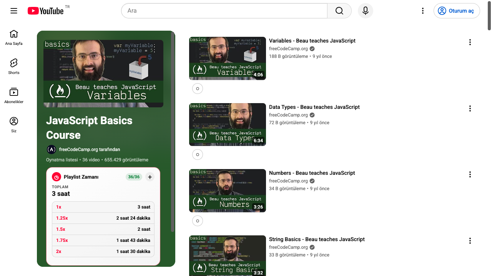
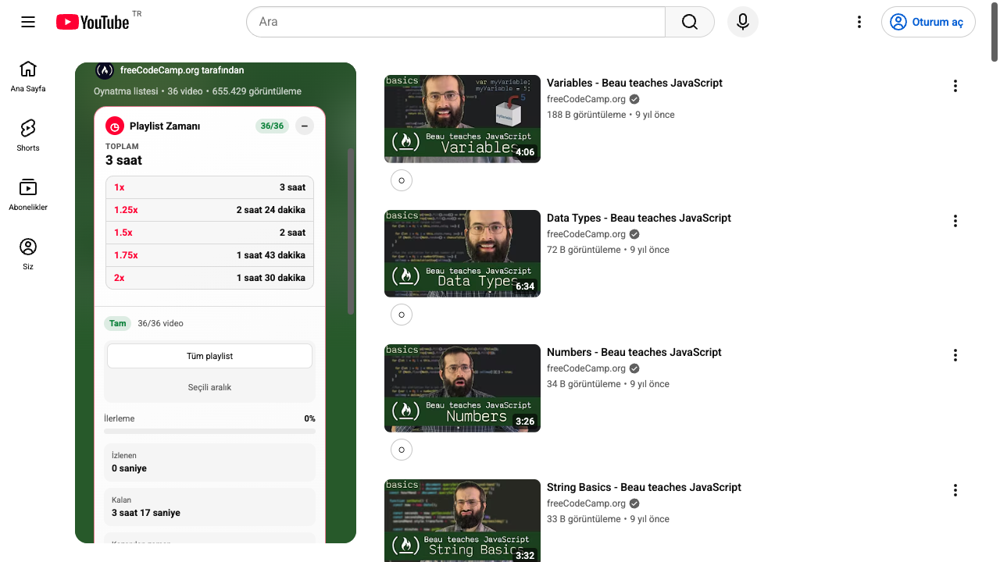

# Playlist Zamanı

YouTube playlistlerinin toplam ve kalan süresini hesaplayan, video ve ses hızını
izin verdiğiniz sitelerde klavyeden yönetmenizi sağlayan hafif tarayıcı eklentisi.

Brave öncelikli geliştirilir; Chrome, Edge, Opera, Firefox ve Zen Browser ile de
uyumludur. Hesaplama ve medya kontrolü cihazda yapılır. Analitik, reklam veya
üçüncü taraf takip servisi kullanılmaz.



## İçindekiler

- [Neler yapabilir?](#neler-yapabilir)
- [Hızlı başlangıç](#hızlı-başlangıç)
- [YouTube playlistlerinde kullanım](#youtube-playlistlerinde-kullanım)
- [Her sitede hız kontrolü](#her-sitede-hız-kontrolü)
- [Klavye kısayolları](#klavye-kısayolları)
- [Popup ve ayarlar](#popup-ve-ayarlar)
- [Video indirme](#video-indirme)
- [Desteklenen tarayıcılar ve siteler](#desteklenen-tarayıcılar-ve-siteler)
- [Sorun giderme](#sorun-giderme)
- [Gizlilik ve izinler](#gizlilik-ve-izinler)
- [Geliştirme ve test](#geliştirme-ve-test)

## Neler yapabilir?

### YouTube playlist asistanı

- Playlistin tamamını `1x`, `1.25x`, `1.5x`, `1.75x`, `2x` ve özel hızlarda hesaplar.
- Toplam, izlenen ve kalan süreyi; video sayısını ve ilerleme yüzdesini gösterir.
- Playlist sayfasında her zaman listenin **toplam süresini** temel bilgi olarak sunar.
- İzleme sayfasında mevcut videonun kalan kısmını sonraki izlenmemiş videolarla birleştirir.
- Başlangıç ve bitiş videosu seçerek belirli bir aralığı hesaplar.
- “Bu videodan itibaren” hesabı, ortalama/en kısa/en uzun video bilgisi ve hızla
  kazanılan süreyi gösterir.
- Günlük hedef ve aktif günlere göre tahmini bitiş tarihini hesaplar.
- Video %90’a ulaştığında otomatik tamamlandı sayar. Bu eşik ayarlardan değiştirilebilir.
- Manuel izlenme seçimlerini otomatik durumdan üstün tutar.
- Son açılan playlistleri, ilerlemeyi ve kaldığınız videoyu **Playlistlerim** ekranında saklar.
- Eksik yüklenen listelerde sonucu “kısmi” olarak işaretler; bilinmeyen süreyi sıfır saymaz.
- Public playlistleri isteğe bağlı YouTube Data API anahtarıyla tamamlayabilir.

### Evrensel medya kontrolü

- Standart HTML5 `<video>` ve `<audio>` oynatıcılarında çalışır.
- Hızı `0.07x–16x` arasında klavye, popup veya video üstündeki küçük rozetle değiştirir.
- Siteye özel hız, son kullanılan hız ve tercih edilen genel hızı hatırlar.
- Aynı sayfadaki oynayan veya son etkileşilen medyayı aktif oynatıcı kabul eder.
- Iframe ve açık/kapalı Shadow DOM içindeki oynatıcıları destekler.
- Oynatıcı hızı sürekli `1x` yapıyorsa isteğe bağlı **hız kilidi** ile seçilen hızı korur.
- Canlı yayında hız değişimini dener; seek desteklenmiyorsa sarma ve işaret özelliklerini zorlamaz.
- `T` ile gerçek tam ekran açmadan videoyu sekmenin içerik alanına yayar.
- Hız rozeti sürüklenebilir; boyutu, opaklığı ve görünürlüğü ayarlanabilir.
- Bütün kısayollar değiştirilebilir ve özel kısayollar eklenebilir.



## Hızlı başlangıç

### Brave, Chrome, Edge ve Opera

Gerekenler: güncel Node.js ve npm.

1. Repoyu indirin ve production paketini oluşturun:

   ```bash
   git clone https://github.com/csmutlu/playlist-uzunluk.git
   cd playlist-uzunluk
   npm install
   npm run build
   ```

2. Tarayıcınızın eklenti sayfasını açın:

   | Tarayıcı | Adres |
   | --- | --- |
   | Brave | `brave://extensions` |
   | Chrome | `chrome://extensions` |
   | Edge | `edge://extensions` |
   | Opera | `opera://extensions` |

3. **Geliştirici modu**nu açın.
4. **Paketlenmemiş öğe yükle** düğmesine basın.
5. Projedeki `.output/chrome-mv3` klasörünü seçin.
6. Playlist Zamanı’nı araç çubuğuna sabitleyin ve önceden açık video sekmelerini yenileyin.

Eklenti güncellendiğinde `npm run build` komutunu yeniden çalıştırın, eklentiler
sayfasındaki **Yeniden yükle** düğmesine basın ve açık sekmeleri yenileyin.

### Firefox ve Zen Browser

1. Firefox paketini oluşturun:

   ```bash
   npm install
   npm run build:firefox
   ```

2. `about:debugging#/runtime/this-firefox` adresini açın.
3. **Geçici Eklenti Yükle** düğmesine basın.
4. `.output/firefox-mv2/manifest.json` dosyasını seçin.
5. Önceden açık video sekmelerini yenileyin.

Geçici kurulum, Firefox veya Zen kapatılana kadar geçerlidir. Kalıcı Firefox
dağıtımı Mozilla imzası gerektirir.

Hazır ZIP oluşturmak için:

```bash
npm run zip
npm run zip:firefox
```

Dosyalar `.output` klasörüne yazılır.

## YouTube playlistlerinde kullanım

### Toplam süreyi görmek

1. YouTube’da bir playlist sayfası açın:
   `https://www.youtube.com/playlist?list=...`
2. Playlist bilgi kartının altında Playlist Zamanı paneli görünür.
3. Kapalı görünümde toplam süre, video sayısı ve seçili hız gösterilir.
4. Panele tıklayarak ayrıntıları açın. `1x`, `1.25x`, `1.5x`, `1.75x` ve `2x`
   karşılıkları alt alta gösterilir.

Playlist sayfasında ana değer toplam süredir. İzleme sayfasındaki kompakt panel
ise mevcut videonun kalan kısmını ve sonraki izlenmemiş videoları temel alır.

### İzlenen ve kalan süre

- Eklenti, oynatma konumunu yerel olarak kaydeder.
- Video, ayarlanan tamamlama eşiğine ulaştığında otomatik izlendi sayılır.
- Bir videoyu manuel işaretlerseniz bu seçim otomatik tespitten öncelikli olur.
- **İlerlemeyi sıfırla** yalnızca ilgili playlist için saklanan izlenme durumunu temizler.

### Video aralığı hesaplamak

Paneli genişletin ve başlangıç/bitiş alanlarından bir aralık seçin. Hesaplama,
iki uçtaki videolar dahil olacak şekilde yapılır. “Bu videodan itibaren”
seçeneği izleme sayfasındaki mevcut videoyu başlangıç kabul eder.

### Eksik veya çok uzun playlistler

YouTube uzun listelerin tamamını ilk açılışta DOM’a eklemeyebilir. Böyle bir durumda
panel, örneğin `46/120 video — kısmi sonuç` yazar.

- **Tüm videoları yükle** işlemi yalnızca siz başlattığınızda kontrollü kaydırma yapar.
- İşlemi iptal edebilirsiniz; önceki kaydırma konumu geri yüklenir.
- Public playlistlerde isteğe bağlı YouTube Data API anahtarı kullanılabilir.
- Watch Later, Liked Videos, private, silinmiş veya gizli videolarda erişilebilen
  veri kadar sonuç gösterilir.

### Çalışma planı

Günlük hedefinizi, aktif günleri ve izleme hızını seçin. Panel; toplam oturum
sayısını, hızla kazanılan süreyi, tahmini bitiş saatini ve bitiş tarihini hesaplar.

## Her sitede hız kontrolü

Evrensel kontrol varsayılan olarak geniş site izni istemez.

1. Araç çubuğundan Playlist Zamanı popup’ını açın.
2. **Tüm sitelerde hız kontrolünü etkinleştir** seçeneğini açın.
3. Tarayıcının site erişimi isteğini onaylayın.
4. Önceden açık video sekmesini bir kez yenileyin.
5. Videoya tıklayın ve `S`/`D` ile hızı değiştirin.

İzin daha sonra kapatılabilir. Kapatıldığında evrensel betik kaydı temizlenir;
YouTube playlist hesaplama özellikleri çalışmaya devam eder.

### Aktif oynatıcı nasıl seçilir?

Bir sayfada video, reklam, fragman ve iframe birlikte bulunabilir. Eklenti şu sırayı kullanır:

1. O anda oynayan medya
2. Son tıklanan veya son etkileşilen medya
3. Ekrandaki en büyük görünür video
4. İlk uygun medya

Belirli bir videoyu yönetmek için önce videoya bir kez tıklayın. Hız değişikliği
yalnızca aktif oynatıcıya uygulanır. İç içe iframe bulunan sayfalarda da tek aktif
oynatıcının rozeti gösterilir; üç video varsa üçünü birden hızlandırmak amaçlanmaz.

### Hız rozeti

Rozet videonun sol üstünde düşük opaklıkla durur ve hız değiştiğinde belirginleşir.

- Rozeti sürükleyerek konumunu değiştirebilirsiniz.
- Rozet üstündeyken fare tekerleğiyle hızı artırıp azaltabilirsiniz.
- Rozete çift tıklamak `1x` ile tercih edilen hız arasında geçiş yapar.
- `V` rozeti sabitler veya gizler.
- Boyut ve opaklık popup’tan ayarlanabilir.

### Sekme içi sinema modu

Aktif videoya tıklayıp `T` tuşuna basın. Video, tarayıcının adres çubuğu ve
sekmeleri görünür kalacak şekilde sekmenin içerik alanını kaplar. `T` tuşuna
yeniden basınca oynatıcı önceki yerine, boyutuna ve stillerine döner.

Bu özellik normal oynatıcı, iframe ve Shadow DOM içindeki oynatıcılar için
tasarlanmıştır. Sitenin kendi tam ekran düğmesinden bağımsızdır.

### Hızı zorla sıfırlayan siteler

Bazı canlı yayın ve platform oynatıcıları hızı tekrar `1x` yapabilir.

1. Popup’tan mevcut siteyi açın.
2. İstediğiniz site hızını seçin.
3. **Hız kilidi**ni etkinleştirin.

Kilit kapalıyken sitenin kendi oynatıcısından yapılan hız değişikliği kabul edilir
ve kaydedilir. Kilit açıkken yalnızca gerçek bir sıfırlama girişiminde seçilen hız
geri uygulanır; sürekli çalışan bir kontrol döngüsü kullanılmaz.

## Klavye kısayolları

| Tuş | Varsayılan işlem |
| --- | --- |
| `S` | Hızı `0.1x` azalt |
| `D` | Hızı `0.1x` artır |
| `R` | `1x` hızına dön |
| `G` | `1x` ile tercih edilen hız arasında geçiş yap |
| `Z` | 10 saniye geri sar |
| `X` | 10 saniye ileri sar |
| `M` | Mevcut konumu işaretle |
| `J` | İşaretlenen konuma dön |
| `T` | Sekme içi sinema modunu aç/kapat |
| `V` | Hız rozetini göster/gizle |

Kısayol düzenleyiciden oynat/duraklat, sessize al, ses artır/azalt gibi işlemler
de eklenebilir. Her kısayola farklı hız, adım, sarma veya ses değeri verilebilir.

Metin alanı, arama kutusu, seçim menüsü veya `contenteditable` alan odaktayken
kısayollar çalışmaz. `Ctrl`, `Cmd` ve `Alt` içeren kombinasyonlar siz özellikle
tanımlamadıkça yok sayılır.

## Popup ve ayarlar

### Evrensel kontrol ayarları

- Tüm sitelerde etkinleştirme veya erişimi tamamen kapatma
- Mevcut siteyi devre dışı bırakma
- Genel, siteye özel ve son kullanılan hız
- Hız kilidi
- Hız adımı ile ileri/geri sarma süresi
- Preset hızlar ve özel hız girişi
- Kısayol düzenleyici ve varsayılanlara dönme
- Rozet boyutu, opaklığı ve özel CSS
- Alan adı, wildcard ve regex tabanlı site kuralları
- Evrensel ayarları JSON olarak içe/dışa aktarma

Site hızı seçiminde öncelik sırası şöyledir:

1. Eşleşen site kuralı
2. Sitenin son kullanılan hızı
3. Genel varsayılan hız

En fazla 200 alan adı hatırlanır. Yalnızca hostname ve oynatma ayarı saklanır;
sayfa başlığı, tam URL veya izleme geçmişi tutulmaz.

### Playlist ayarları

- Arayüz dili veya otomatik dil algılama
- YouTube ile uyumlu açık/koyu/otomatik tema
- Varsayılan ve özel oynatma hızı
- Saniyeleri gösterme
- Otomatik tamamlanma yüzdesi
- İsteğe bağlı YouTube Data API anahtarı
- Playlist ilerlemesini sıfırlama
- Ayarları ve ilerlemeyi JSON olarak içe/dışa aktarma

Desteklenen arayüz dilleri: Türkçe, İngilizce, İspanyolca, Fransızca, Arapça,
Almanca, Portekizce, Rusça, Hintçe, Endonezce, Japonca, Korece ve Çince.

## Video indirme

Popup’taki indirme işlemi yalnızca sayfanın doğrudan sunduğu `http/https`
adresli MP4, WebM ve benzeri HTML5 medya dosyaları içindir. İlk kullanımda
tarayıcıdan `downloads` izni istenir.

Şunlar indirilmez veya aşılmaya çalışılmaz:

- DRM korumalı Netflix, HBO Max ve benzeri yayınlar
- `blob:` adresleri
- Parçalı HLS/DASH akışları
- Sitenin erişim veya kopya koruması

İndirme düğmesi görünmüyor ya da işlem reddediliyorsa oynatıcı büyük olasılıkla
doğrudan indirilebilir bir medya adresi sunmuyordur.

## Desteklenen tarayıcılar ve siteler

| Ortam | Destek |
| --- | --- |
| Brave | Birincil geliştirme ve gerçek tarayıcı testleri |
| Chrome, Edge, Opera | Chromium MV3 paketi |
| Firefox, Zen Browser | Firefox MV2 paketi |
| YouTube | Playlist paneli ve evrensel medya kontrolü |
| Standart HTML5 video/ses | Tam evrensel kontrol |
| Iframe ve Shadow DOM oynatıcıları | Erişilebildiği ölçüde destek |
| Netflix, HBO Max, Kick ve benzeri platformlar | Oynatıcı `playbackRate` değişimine izin verdiği ölçüde |
| Canlı yayınlar | Hız destekleniyorsa hız kontrolü; seek yoksa sarma kapalı |

Tarayıcının sistem sayfalarında, eklenti mağazasında veya teknik olarak hızı
engelleyen bir oynatıcıda çalışması mümkün değildir. DRM kullanılması tek başına
hız kontrolünü her zaman engellemez; son karar sitenin oynatıcısına aittir.

## Sorun giderme

### YouTube paneli görünmüyor

- Adresin bir playlist veya playlist içeren izleme sayfası olduğunu kontrol edin.
- Eklentiler sayfasından Playlist Zamanı’nı yeniden yükleyin.
- YouTube sekmesini tamamen yenileyin.
- Aynı eklentinin eski bir kopyası yüklüyse devre dışı bırakın.

### Kısayollar çalışmıyor

- Popup’tan evrensel hız kontrolünün açık olduğundan emin olun.
- Siteyi devre dışı bırakan bir kural bulunmadığını kontrol edin.
- Önce yönetmek istediğiniz videoya tıklayın.
- İmlecin arama veya yazı alanında olmadığını kontrol edin.
- Özel kısayolları varsayılanlara döndürerek olası çakışmayı deneyin.

### Birden fazla video var ama yalnızca biri hızlanıyor

Bu beklenen davranıştır. Reklam, arka plan videosu veya başka iframe’leri yanlışlıkla
hızlandırmamak için yalnızca aktif oynatıcı yönetilir. Başka bir videoya tıklayıp
`S` veya `D` tuşunu kullandığınızda hedef değişir.

### Birden fazla hız rozeti görünüyor

Güncel production paketini oluşturup eklentiyi ve sayfayı yeniden yükleyin. İç içe
iframe’lerde yalnızca aktif oynatıcı rozeti görünmelidir.

### Site hızı tekrar `1x` yapıyor

Mevcut site için **hız kilidi**ni açın. Oynatıcı seçilen hızı teknik olarak
reddediyorsa eklenti sonsuz tekrar yapmaz; bu durumda site için hız değiştirilemez.

### İleri/geri sarma çalışmıyor

Canlı yayın veya süresiz medya seek kabul etmeyebilir. Bu durumda `Z`, `X`, `M`
ve `J` işlemleri güvenli biçimde devre dışı kalır.

### Playlist sonucu eksik

Panelde **Tüm videoları yükle** işlemini başlatın veya public playlist için API
anahtarı ekleyin. Private, Watch Later ve Liked Videos listelerinde API sonucu
alınamayabilir.

### Ayarları temizlemek istiyorum

Popup’taki sıfırlama seçeneklerini kullanın. Önce JSON dışa aktarımı yaparsanız
ayarlarınızı ve playlist ilerlemenizi daha sonra geri yükleyebilirsiniz.

Sorun devam ederse tarayıcı, eklenti sürümü, site adresi ve tekrar adımlarını
ekleyerek [GitHub Issues](https://github.com/csmutlu/playlist-uzunluk/issues)
üzerinden bildirebilirsiniz. Hesap, parola, API anahtarı veya kişisel veri paylaşmayın.

## Gizlilik ve izinler

Zorunlu izinler:

- `storage`: ayarlar ve playlist ilerlemesi
- `scripting`: isteğe bağlı evrensel betiği kaydetmek
- `youtube.com`: playlist paneli ve YouTube oynatıcı entegrasyonu

Yalnızca ilgili özellik kullanıldığında istenen izinler:

- `http://*/*` ve `https://*/*`: bütün sitelerde hız kontrolü
- `googleapis.com`: YouTube Data API ile eksik playlisti tamamlama
- `downloads`: doğrudan medya dosyasını indirme
- Yerel dosya erişimi: yalnızca tarayıcının eklenti ayarından ayrıca izin verirseniz

Eklenti analitik, telemetri veya reklam bağlantısı kurmaz. API anahtarı yalnızca
yerel eklenti depolamasında tutulur ve loglanmaz. Ayrıntılar için
[Gizlilik Politikası](PRIVACY.md) dosyasına bakın.

## Performans yaklaşımı

- Sürekli `setInterval`, DOM polling veya arka plan ağı kullanılmaz.
- Playlist değişiklikleri olaylarla ve dar kapsamlı `MutationObserver` ile izlenir.
- Yeni DOM düğümleri toplu işlenir; bütün sayfa tekrar tekrar taranmaz.
- Büyük playlistlerin ilk analizi tarayıcının boş zamanında parçalara bölünür.
- Evrensel kontrol Preact veya playlist paketini yüklemeyen ayrı, küçük bir betiktir.
- Görünmeyen sekmede isteğe bağlı görsel işler durdurulur.
- Service worker yalnızca mesaj veya bakım gerektiğinde uyanır.
- Ayarlar yalnızca gerçekten değiştiğinde toplu olarak depolamaya yazılır.

Production bütçeleri:

- YouTube content script: sıkıştırılmış `120 KB` altında
- Evrensel content script: sıkıştırılmış `35 KB` altında
- MAIN-world uyumluluk köprüsü: sıkıştırılmış `5 KB` altında
- 1.000 medya fixture’ında eklenti kaynaklı `50 ms` üzeri uzun görev olmaması

## Geliştirme ve test

Geliştirme sunucusu:

```bash
npm run dev
```

Tip kontrolü, birim testleri ve production build:

```bash
npm run check
```

Firefox build doğrulaması:

```bash
npm run check:firefox
```

Gerçek Brave senaryoları:

```bash
npm run test:brave
npm run test:tabii
npm run test:stress
```

- `test:brave`; playlist paneli, `S`/`D`, iframe/Shadow DOM `T` modu, yazı alanı
  koruması, dinamik medya ve Playlistlerim ekranını izole Brave profilinde doğrular.
- `test:tabii`; Tabii TRT 1 canlı oynatıcısında hız kilidini test eder.
- `test:stress`; 1.000 medya öğesinde paket boyutu, uzun görev ve boşta CPU bütçesini ölçer.

Testler geçici profiller kullanır; kişisel Brave profiline veya tarayıcı verilerine dokunmaz.

## Katkı ve güvenlik

- Katkıda bulunmadan önce [CONTRIBUTING.md](CONTRIBUTING.md) dosyasını okuyun.
- Güvenlik açığını herkese açık issue yerine [SECURITY.md](SECURITY.md) içindeki
  yöntemle bildirin.
- Mağaza açıklaması için [STORE_LISTING.md](STORE_LISTING.md) dosyasına bakın.
